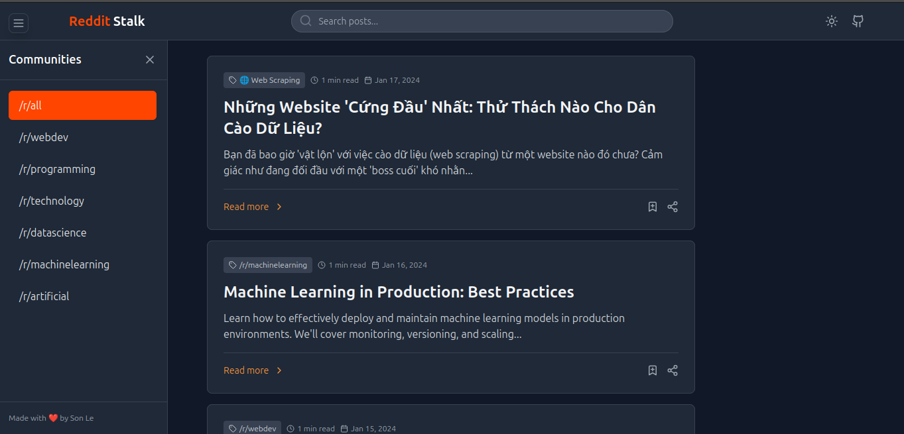

# 🔍 Reddit Stalk

[](https://lethanhson9901.github.io/reddit-stalk)
[](https://github.com/lethanhson9901/reddit-stalk/commits/main)
[](https://opensource.org/licenses/MIT)

A modern, responsive Reddit content explorer built with React and Tailwind CSS. Browse and search through Reddit communities with a beautiful, dark-mode supported interface.



## ✨ Features

- 🌗 Dark/Light mode support with system preference detection
- 📱 Fully responsive design
- 🔍 Real-time search functionality
- 📂 Collapsible sidebar for community navigation
- ⚡ Fast and smooth transitions
- 📊 Reading time estimation
- 🔝 Scroll to top functionality
- 🎨 Modern UI with Tailwind CSS
- 🎯 Category-based content filtering
- 🔒 Admin authentication system
- 🔐 Public/Private post management

## 🚀 Demo

Visit the live demo: [Reddit Stalk](https://lethanhson9901.github.io/reddit-stalk)

## 🛠️ Technologies Used

- React 19
- Tailwind CSS
- Lucide Icons
- GitHub Pages

## 📦 Installation

1. Clone the repository:
```bash
git clone https://github.com/lethanhson9901/reddit-stalk.git
cd reddit-stalk
```

2. Install dependencies:
```bash
npm install
```

3. Set up environment variables:
```bash
# Copy environment example files
cp .env.example .env.development
cp .env.example .env.production

# Edit the environment files with your configurations
```

4. Start the development server:
```bash
npm start
```

## 🔧 Environment Configuration

The application uses different environment files for development and production:

### Development Environment (.env.development)
```env
REACT_APP_ADMIN_USERNAME=your_admin_username
REACT_APP_ADMIN_PASSWORD=your_admin_password
REACT_APP_BASE_URL=http://localhost:3000/reddit-stalk
```

### Production Environment (.env.production)
```env
REACT_APP_ADMIN_USERNAME=your_admin_username
REACT_APP_ADMIN_PASSWORD=your_admin_password
REACT_APP_BASE_URL=https://lethanhson9901.github.io/reddit-stalk
```

### Environment Variables
| Variable | Description | Required |
|----------|-------------|----------|
| REACT_APP_ADMIN_USERNAME | Admin login username | Yes |
| REACT_APP_ADMIN_PASSWORD | Admin login password | Yes |
| REACT_APP_BASE_URL | Base URL for the application | Yes |

### Important Notes
- Never commit your actual environment files (.env.development, .env.production)
- Keep your admin credentials secure
- Use different credentials for development and production
- The .env.example file serves as a template and can be committed to the repository

## 📝 Usage

1. Start the application
2. Use the sidebar to select different Reddit communities
3. Search for specific content using the search bar
4. Toggle between dark and light modes using the theme switcher
5. Click "Read more" to view full posts
6. Use the scroll-to-top button for easy navigation

### Admin Features
1. Access admin login at `/admin`
2. Manage post visibility (public/private)
3. Edit and delete posts
4. View all posts regardless of visibility status

## 🚀 Deployment

1. Update your production environment variables:
```bash
# Edit .env.production with your production settings
```

2. Deploy to GitHub Pages:
```bash
npm run deploy
```

## 🤝 Contributing

1. Fork the repository
2. Create your feature branch (`git checkout -b feature/AmazingFeature`)
3. Commit your changes (`git commit -m 'Add some AmazingFeature'`)
4. Push to the branch (`git push origin feature/AmazingFeature`)
5. Open a Pull Request

## 📄 License

This project is licensed under the MIT License - see the [LICENSE](LICENSE) file for details.

## 👨‍💻 Author

- **Son Le** - [GitHub](https://github.com/lethanhson9901)

## 🙏 Acknowledgments

- [Lucide Icons](https://lucide.dev/) for beautiful icons
- [Tailwind CSS](https://tailwindcss.com/) for styling
- [React](https://reactjs.org/) for the framework

---

<p align="center">Made with ❤️ by Son Le</p>